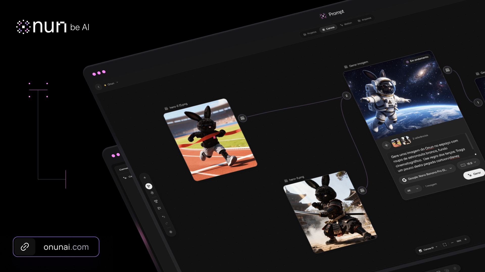
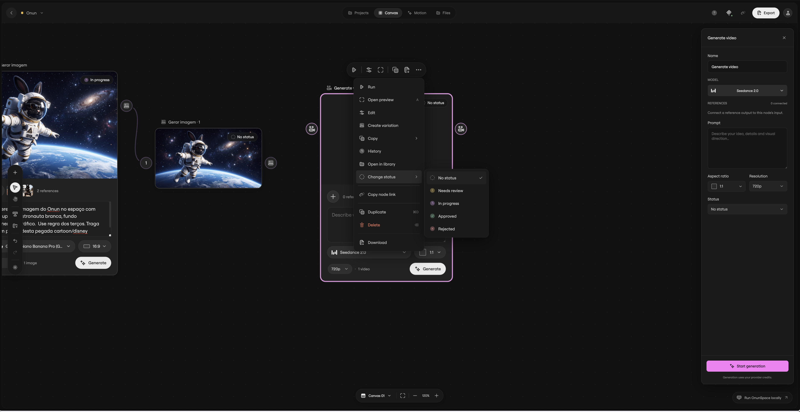
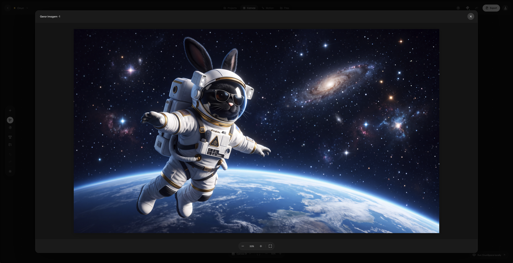
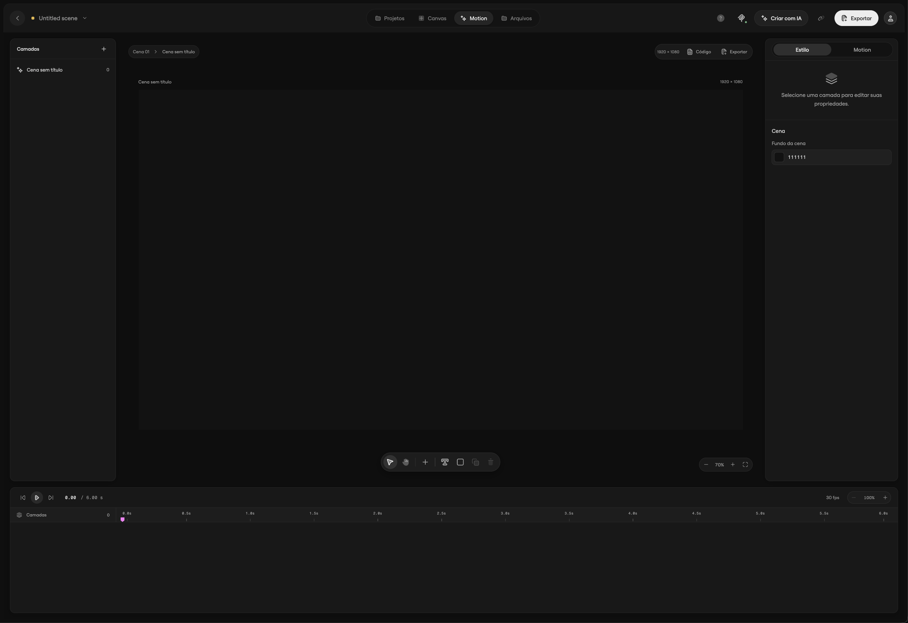
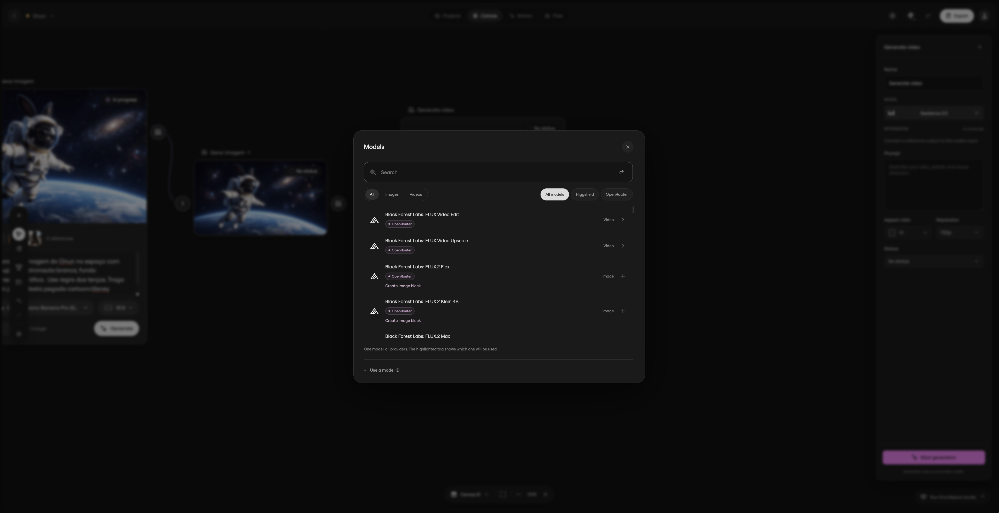
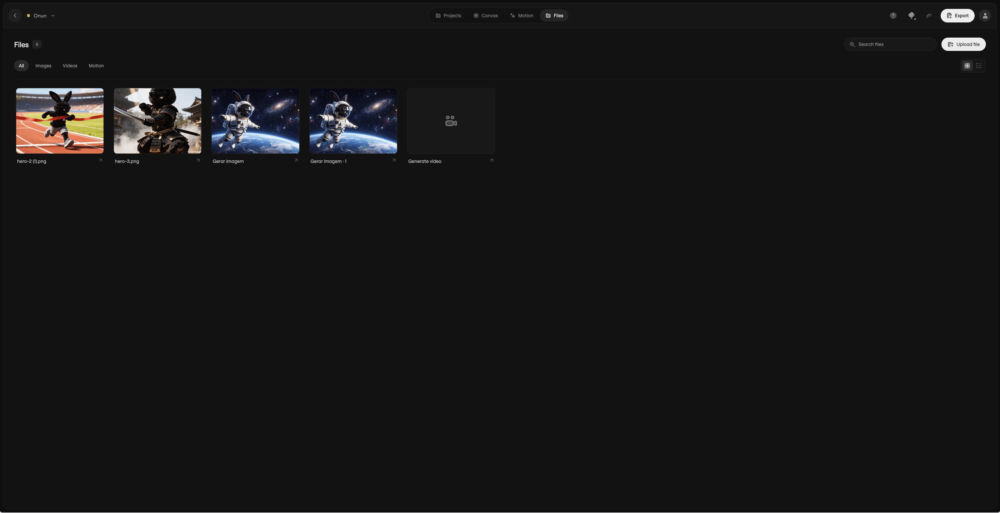
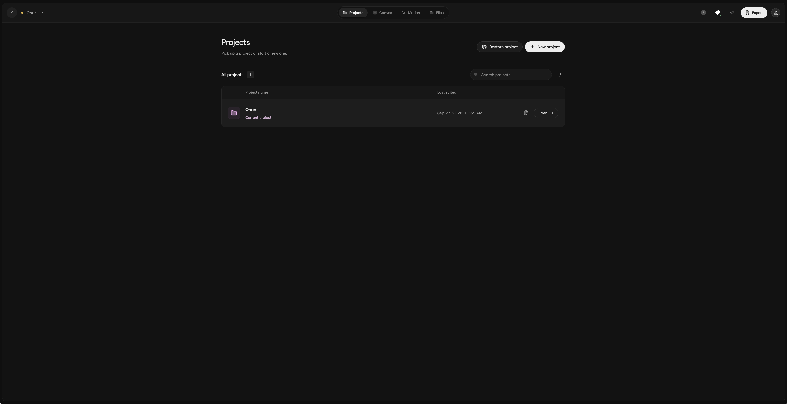

# OnunSpace

**An independent, open-source alternative to Magnific / Freepik Spaces.**

A local creative workspace for image and video generation, connected references, and editable motion. Arrange ideas on a canvas, choose your own AI providers, and build motion with layers, keyframes, or HTML/CSS/GSAP. Connect an MCP-compatible assistant to work on the same projects.

[Onun](https://onunai.com) · [Use OnunSpace online](https://app.onunai.com/app/space) · [Local runtime and MCP](docs/local-runtime.md) · [Motion documentation](docs/motion-runtime.md)

OnunSpace is an independent project and is not affiliated with or endorsed by Magnific or Freepik.

## What you can do

- Connect prompts and image references on a node canvas. Import images by upload, drag and drop, or paste.
- Generate images and videos through your own OpenRouter or Higgsfield account. Model availability and supported inputs depend on the provider.
- Toggle native audio on supported video models with the speaker button. The choice is saved with the project and generation history; models without audio support hide the control.
- Edit motion layers, text, colors, styles, transforms, and keyframes. Use custom HTML/CSS/GSAP for code-driven scenes.
- Export local motion compositions as MP4 or WebM using Chromium and FFmpeg.
- Save projects locally and move them with portable `.onun` or ZIP archives, including referenced media.
- Let an MCP-compatible assistant inspect and edit projects, manage layers, and start generation or rendering.
- Use the editor in English or Portuguese, in a browser or the Electron desktop window.

New projects start empty. The Canvas guide adds temporary examples when needed; Motion stays empty unless you add your own content.

## A look inside

### Canvas and generation

Connect references, configure a model, and inspect generated media on the canvas.





### Motion editor

Style your layers and animate them on the timeline.



<details>
<summary>Model catalog, files, and projects</summary>

Browse the model catalog, organize project media, and reopen saved work.







</details>

## Run locally

Install **Node.js 22.16 or newer**, npm, and Git. No Onun account is required for the local editor.

```sh
git clone https://github.com/onunbeai/OnunSpace.git
cd OnunSpace
npm ci
npm run dev
```

Open **http://127.0.0.1:5178**. The local API runs at **http://127.0.0.1:4318**. Keep the terminal open while using the editor.

### Video export dependencies

Install FFmpeg with your operating system's package manager and install the Chromium browser used by Playwright:

```sh
npx playwright install chromium
ffmpeg -version
```

On Linux, `npx playwright install --with-deps chromium` also installs Chromium's system dependencies and may request administrator access. If your binaries are elsewhere, set `ONUN_FFMPEG_PATH` and `ONUN_CHROMIUM_PATH` in `.env`.

Chromium and FFmpeg are required for local motion exports, not for arranging your canvas or calling image-generation providers. Exports currently do not include audio, transparency, or multi-scene sequencing.

### Built app and desktop window

```sh
npm run build
npm start
```

The built browser app is served at **http://127.0.0.1:4318**. To open the Electron window after building, run `npm run desktop` instead. It starts the local runtime when needed. This repository provides a source-based desktop launcher, not a signed installer or automatic updater.

## Connect AI providers

Open the editor's settings and add your **OpenRouter** or **Higgsfield** key. Generation runs on those providers and uses your account's credits. Editing and local motion rendering run on your computer; this repository does not bundle a local image or language model.

You can also copy `.env.example` to `.env` and configure only the services you use. Paste the complete Higgsfield credential into `HF_CREDENTIALS`; the legacy split-key variables are optional alternatives.

Keys entered in the local interface are saved under `.onun/private/credentials.json`, with owner-only file permissions where supported. This is local plaintext storage, not encrypted storage. Keys are excluded from project archives and must never be committed. See [security](SECURITY.md) for the runtime's trust boundary.

## Connect an assistant through MCP

Start OnunSpace, open **MCP connection** in settings, and copy the configuration generated for your computer into your MCP client. Keep the local runtime running. The stdio server and editor share the same project API.

The [MCP guide](docs/local-runtime.md) explains configuration, tools, revisions, and portable backups. Agent authoring guides are also included in [skills/onunspace-motion](skills/onunspace-motion/SKILL.md) and [skills/onunspace-motion-review](skills/onunspace-motion-review/SKILL.md).

## Local and online editions

This repository is the standalone local edition. It does not require Cloudflare R2, a database, a WebContainer, or an Onun account. The hosted edition at [app.onunai.com](https://app.onunai.com/app/space) is integrated into the separate Onun platform; its account services and deployment are not part of this repository.

By default, local projects, imported assets, and exports live in `.onun/`. Set `ONUN_DATA_DIR` to use another directory. When Electron starts its own runtime, it uses the operating system's application data directory. Portable `.onun` archives let you move a project between installations and editions.

## Development

```sh
npm run typecheck
npm run lint
npm test
npm run build
```

Some integration tests perform real local Chromium/FFmpeg renders, so install the export dependencies first. With `npm run dev` running, `npm run test:browser` runs the browser smoke checks. Provider tests use controlled responses; running them does not establish compatibility with every live model or account.

See [CONTRIBUTING.md](CONTRIBUTING.md) for development guidance and [SECURITY.md](SECURITY.md) for reporting security issues.

The public source edition bundles the open-licensed Inter and Fragment Mono fonts. The screenshots above were supplied from the Onun edition and may show its original brand typography.

## License

Original OnunSpace code is available under the [MIT License](LICENSE). Third-party packages, fonts, provider logos, and brand artwork retain their own rights and license terms; see [THIRD_PARTY_NOTICES.md](THIRD_PARTY_NOTICES.md). The code license does not grant rights to third-party trademarks or relicense bundled media.
